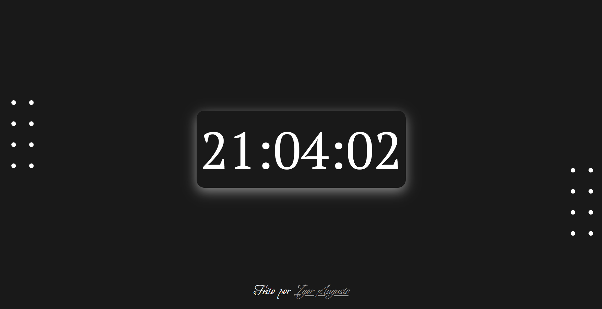

# Relógio Digital
<div align="center">

</div>

## Descrição

Relógio digital inovador e elegante que oferece uma forma contemporânea de exibir a hora. Este software foi desenvolvido com foco na simplicidade, usabilidade e design estético.

## Status do projeto
Projeto concluído.

## Pré-requisitos

- HTML5;
- CSS3;
- JavaScript (ECMAScript 2022).

## Instalando

1. Clone o repositório para o seu ambiente local:

```
$ git clone https://github.com/igoraugustobrz/RelogioDigital
```

2. Navegue até o diretório do projeto.

```
$ cd RelogioDigital
```

## Contribuindo

Contribuições são bem-vindas! Se você quiser contribuir para o projeto, siga as etapas abaixo:

1. Fork o repositório e clone-o para o seu ambiente local.

2. Crie uma nova branch:

```
git checkout -b minha-contribuicao
```

3. Faça as alterações desejadas e commit-as:

```
git commit -m "Minha contribuição"
```

4. Envie suas alterações para o repositório remoto:

```
git push origin minha-contribuicao
```

5. Abra uma solicitação de pull no repositório original.

## Autor

- Igor Augusto
- E-mail: igoraugustobz@gmail.com
- Conecte-se comigo no [LinkedIn](https://www.linkedin.com/in/igoraugustobrz/).